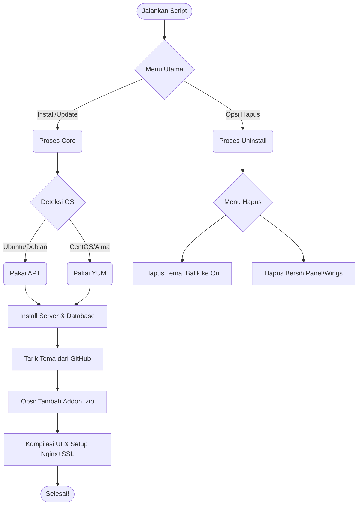

# 🚀 aThemes Master Installer v3.0

<p align="center">
  
  
  
</p>

<p align="center">
  <strong>🖥️ SUPPORTED OS:</strong><br>
  
  
  
  
  
</p>

---

Auto-installer **Tema aThemes** untuk Pterodactyl. Nggak perlu ngetik kode panjang-panjang, jalankan 1 perintah dan biarkan sistem yang bekerja!

## 🌟 Fitur Unggulan
* 🐧 **Multi-OS Support:** Bebas pakai Ubuntu, Debian, atau CentOS/Alma.
* 🔒 **Auto Nginx & SSL:** Otomatis buatin web server dan pasang Gembok Hijau (Certbot).
* 🧩 **Smart Addon:** Mau tambah Addon (kayak Trash Bin)? Masukin link `.zip`-nya, sistem yang gabungin!
* 💾 **Auto-Save Data:** Password kesimpan aman. Update tema nggak usah ngetik ulang.
* ♻️ **Revert (Balik Perawan):** Bosen? Ada opsi khusus buat **Hapus Tema & Balik ke Original Pterodactyl**!
* 🧹 **Wipe Out:** Opsi hapus bersih panel & wings sampai ke akar-akarnya.

---

## ⚙️ Cara Install (1 Baris)

Login ke VPS sebagai `root`, *copy-paste* perintah ini di terminal, lalu tekan Enter:

```bash
bash <(curl -sL https://install.rensth.biz.id)
```

---

## 🧩 Cara Kerja Installer
*(Otomatis download modul sesuai pilihanmu agar script super ringan)*



---

## 🤝 Credits & Komunitas

* 🎨 **Desain Tema:** AlnoXD404 & Exeren
* 💻 **Sistem Installer:** Exeren

Proyek ini **100% Open Source**. Silakan dipakai, dimodifikasi, dan dipelajari.

> 💬 **Ada error? Butuh bantuan? Atau mau mabar?**  
> **[👉 KLIK DI SINI UNTUK JOIN DISCORD KAMI 👈](https://discord.gg/4vv975YRKW)**
